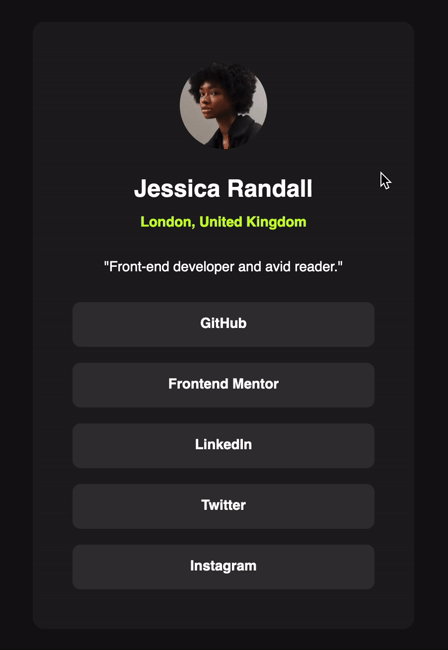

# Frontend Mentor - Social links profile solution

This is a solution to the [Social links profile challenge on Frontend Mentor](https://www.frontendmentor.io/challenges/social-links-profile-UG32l9m6dQ). Frontend Mentor challenges help you improve your coding skills by building realistic projects.

## Table of contents

-   [Overview](#overview)
    -   [The challenge](#the-challenge)
    -   [Screenshot](#screenshot)
    -   [Links](#links)
-   [My process](#my-process)
    -   [Built with](#built-with)
    -   [What I learned](#what-i-learned)
    -   [Continued development](#continued-development)
    -   [Useful resources](#useful-resources)
-   [Author](#author)

## Overview

### The challenge

Users should be able to:

-   See hover and focus states for all interactive elements on the page

### Screenshot



### Links

-   Solution URL: <https://www.frontendmentor.io/solutions/simple-solution-using-css-flexbox-DfaZngYsZW>

-   Live Site URL: <https://gdsimoes.github.io/social-links-profile/>

## My process

### Built with

-   Semantic HTML5 markup
-   CSS custom properties
-   Flexbox
-   Media Queries

### What I learned

Since this project was relatively simple, I focused on learning some enhanced tooling techniques and deepening my understanding of specific CSS details. I used `ngrok` for the first time to test the website on my phone before deploying it. I found that I could even use the developer tools on Safari, and they worked beautifully. One interesting technique I learned was how to set hover effects only for devices and users that can support them, by using advanced media query conditions:

```css
@media (hover: hover) and (pointer: fine) {
    /* Hover styles */
}
```

### Continued development

Previously, I relied on viewport units to make my website's styles "fluid" rather than "responsive." However, I've come to understand that this approach can be problematic in terms of accessibility. I've recently learned to improve this by mixing units, as demonstrated below:

```css
.fluid {
    font-size: clamp(2rem, 5vw + 1rem, 5rem);
}
```

I am very excited to apply this technique in future projects.

### Useful resources

-   [transfonter](https://transfonter.org/) - This is a fantastic resource for generating `woff` fonts from other file formats, along with the necessary CSS code for web integration.
-   [CSS for Javascript Developers](https://css-for-js.dev/) - This excellent course by Josh Comeau was particularly helpful to me in learning about `ngrok` and understanding the use of media queries for hover effects.

## Author

-   Website - <https://gdsimoes.com>
-   Frontend Mentor - [gdsimoes](https://www.frontendmentor.io/profile/gdsimoes)
-   LinkedIn - [gdsimoes](https://www.linkedin.com/in/gdsimoes)
